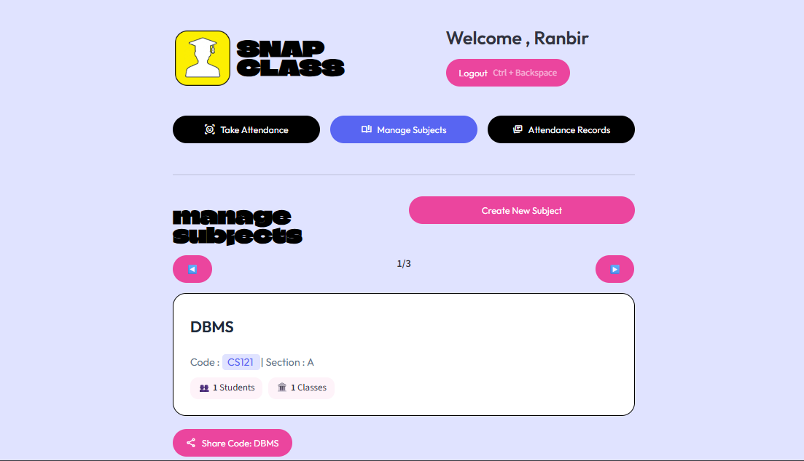
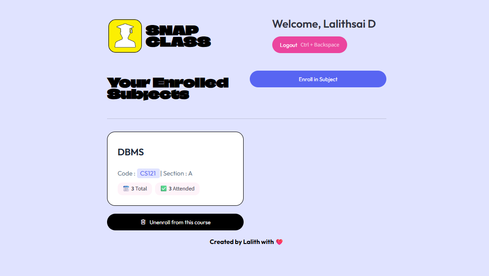
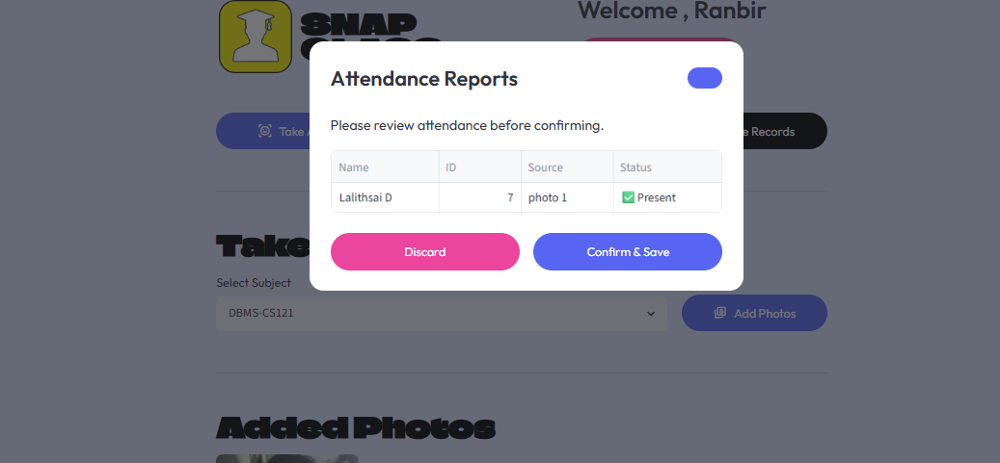
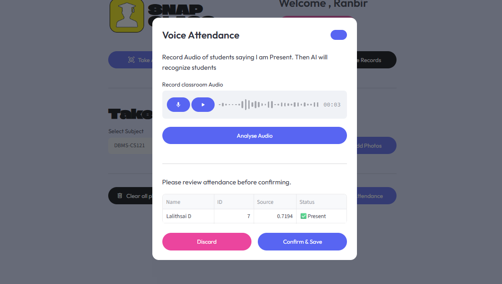

# SnapClass AI – Smart Attendance Management System

## 📚 Overview

SnapClass AI is an AI-powered attendance management system that automates classroom attendance using **Face Recognition**, **Voice Recognition**, and **QR-based Enrollment**.

The platform provides separate dashboards for **Teachers** and **Students**, enabling seamless attendance tracking, subject management, and enrollment.

Built using **Streamlit**, **Supabase**, **Dlib**, and **Machine Learning**, SnapClass AI aims to reduce manual attendance effort and improve classroom management.

---

## 🚀 Live Demo

**Application:**

```text
https://snapclass-ai-v1.streamlit.app
```

---

## ✨ Features

### 👨‍🏫 Teacher Features

* Teacher Registration & Login
* Create Subjects/Courses
* Generate QR Code & Share Join Links
* View Subject Statistics
* Face-Based Attendance
* Voice-Based Attendance
* Manual Attendance Review
* Attendance Reports & Analytics

---

### 👨‍🎓 Student Features

* FaceID Login
* New Student Registration
* Optional Voice Enrollment
* Enroll Using Subject Code
* QR-Based Subject Enrollment
* View Enrolled Subjects
* Unenroll from Courses

---

### 🤖 AI Features

#### Face Recognition

* Dlib Face Detection
* Face Embedding Generation
* Face Identification using SVM Classifier
* Automatic Attendance Marking

#### Voice Recognition

* Voice Embedding Extraction
* Speaker Verification
* Attendance Through Classroom Audio

---

## 🏗️ Tech Stack

### Frontend

* Streamlit

### Backend

* Python

### Database

* Supabase

### Machine Learning

* Dlib
* Scikit-Learn
* NumPy

### Voice Processing

* Librosa
* Resemblyzer

### QR Generation

* Segno

### Authentication

* Bcrypt Password Hashing

---

## 📂 Project Structure

```text
snapclass-ai-attendance-system/
│
├── app.py
│
├── src/
│   ├── screens/
│   │   ├── home_screen.py
│   │   ├── teacher_screen.py
│   │   └── student_screen.py
│   │
│   ├── components/
│   │   ├── dialogs
│   │   ├── cards
│   │   ├── header.py
│   │   └── footer.py
│   │
│   ├── database/
│   │   ├── config.py
│   │   └── db.py
│   │
│   ├── pipelines/
│   │   ├── face_pipeline.py
│   │   └── voice_pipeline.py
│   │
│   └── ui/
│       └── base_layout.py
│
├── screenshots/
│   └── Photos
│
├── requirements.txt
└── README.md
```

---

## 🧠 How Face Recognition Works

1. Student registers with a face image.
2. Dlib generates a 128-dimensional face embedding.
3. Embeddings are stored in Supabase.
4. During attendance:

   * Face is detected.
   * Embedding is generated.
   * SVM classifier predicts identity.
   * Similarity threshold validates match.
5. Attendance is automatically marked.

---

## 🎤 How Voice Recognition Works

1. Student records a voice sample.
2. Voice embeddings are generated using Resemblyzer.
3. Embeddings are stored in Supabase.
4. Classroom audio is processed.
5. Matching students are marked present.

---

## 🗄️ Database Schema

### Teachers

| Column     | Type    |
| ---------- | ------- |
| teacher_id | Integer |
| username   | Text    |
| password   | Text    |
| name       | Text    |

---

### Students

| Column           | Type    |
| ---------------- | ------- |
| student_id       | Integer |
| name             | Text    |
| face_embeddings  | JSON    |
| voice_embeddings | JSON    |

---

### Subjects

| Column       | Type    |
| ------------ | ------- |
| subject_id   | Integer |
| subject_code | Text    |
| name         | Text    |
| section      | Text    |
| teacher_id   | Integer |

---

### Subject Students

| Column     | Type    |
| ---------- | ------- |
| student_id | Integer |
| subject_id | Integer |

---

### Attendance Logs

| Column     | Type      |
| ---------- | --------- |
| student_id | Integer   |
| subject_id | Integer   |
| timestamp  | Timestamp |
| is_present | Boolean   |

---

## ⚙️ Installation

### Clone Repository

```bash
git clone https://github.com/lalithsai-gif/snapclass-ai-attendance-system.git

cd snapclass-ai-attendance-system
```

### Create Virtual Environment

```bash
python -m venv venv
```

Activate:

```bash
venv\Scripts\activate
```

### Install Dependencies

```bash
pip install -r requirements.txt
```

---

## 🔐 Environment Setup

Create:

```text
.streamlit/secrets.toml
```

```toml
SUPABASE_URL="your_supabase_url"

SUPABASE_KEY="your_supabase_key"
```

---

## ▶️ Run Locally

```bash
streamlit run app.py
```

---

## 📸 Landing Page

```text

```

## 📸 Screenshots


### Home Page

```text

```

### Teacher Dashboard

```text

```

### Student Dashboard

```text

```

### Face Attendance

```text

```

### Voice Attendance

```text

```

---

## 🌟 Future Improvements

* Multi-face Embedding Storage
* Enhanced Voice Matching
* Attendance Session Management
* Email Notifications
* Attendance Export to Excel/PDF
* Mobile App Integration
* Advanced Analytics Dashboard

---

## 👨‍💻 Author

**Lalith Sai Dabbiru**

GitHub: *https://github.com/lalithsai-gif*

LinkedIn: *https://www.linkedin.com/in/lalithsai-dabbiru-9b281b375*

---

## 📄 License

This project is developed for educational and portfolio purposes.

Feel free to fork, learn, and build upon it. 🚀
